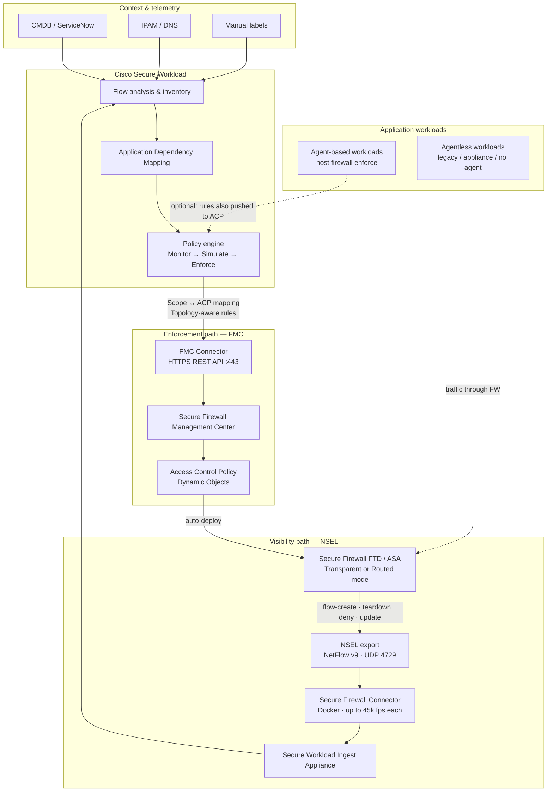
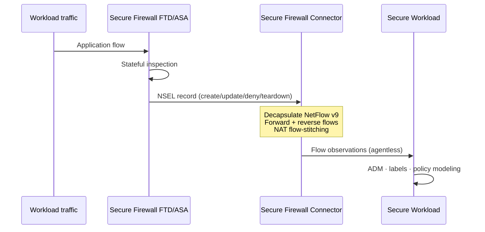
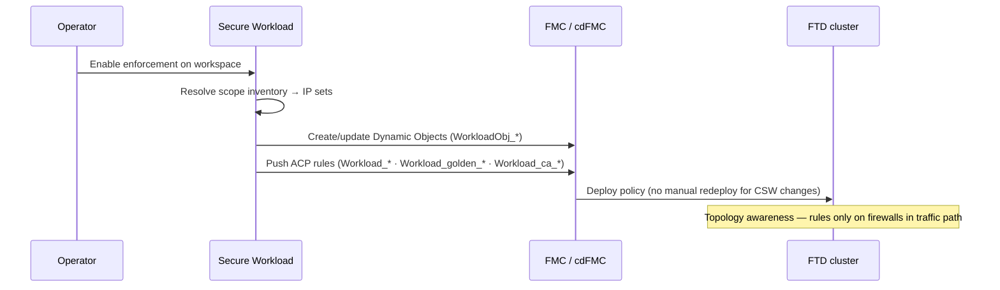
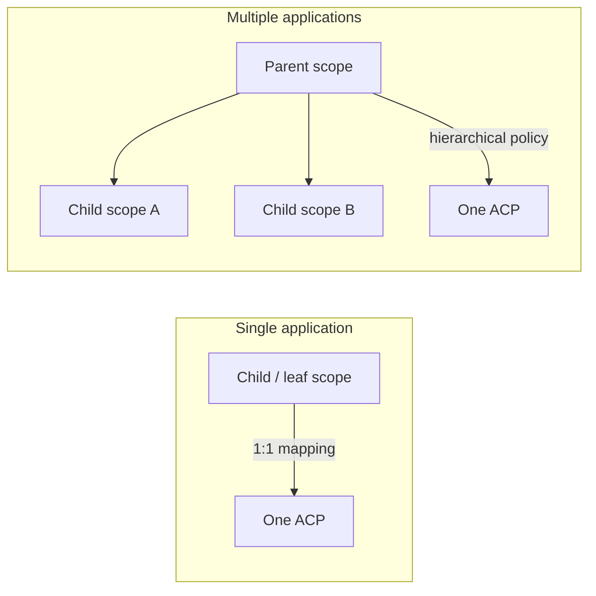
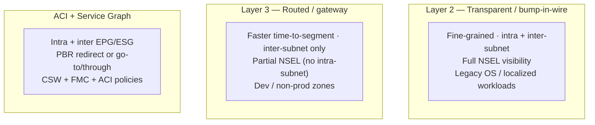
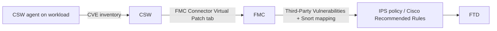
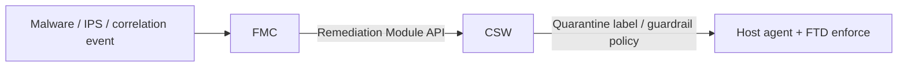

# CSW + Secure Firewall — Architecture Reference

**Single source of truth for all architecture diagrams in this repo.** Other documents link here instead of repeating diagrams.

**Video walkthrough:** Cisco TME **Jorge Quintero** — 3-part series on [@ciscosecureworkload](https://www.youtube.com/@ciscosecureworkload): [Part 1 — design](https://youtu.be/vdHjAl48SuI) · [Part 2 — deployment](https://www.youtube.com/watch?v=xpbg3s0vrcI) · [Part 3 — operations](https://www.youtube.com/watch?v=X65mwN7kJGg)

Derived from the [Cisco Secure Workload & Secure Firewall deep dive](https://secure.cisco.com/secure-workload/docs/secure-workload-whitepaper) and the [FMC Integration Guide](https://www.cisco.com/c/en/us/td/docs/security/workload_security/secure_workload/integration/fmc/cisco-secure-workload-and-fmc-integration-guide.html).

> **Disclaimer:** Companion material — validate against your CSW and FMC release notes before production.

---

## 1. High-level integration (microsegmentation)

This is the reference architecture for **agentless east-west segmentation** using NSEL visibility and FMC enforcement.

**Key idea:** Visibility and enforcement use **different connectors**. NSEL tells CSW what flows exist; the FMC connector pushes **L3/L4 segmentation policy** to FTD when you enforce a workspace.

---

## 2. Data flow — visibility (NSEL)

| NSEL capability | Customer value |
|-----------------|----------------|
| **Stateful events** | See permits and **denies** — not just sampled NetFlow |
| **Bidirectional flows** | Connector exports forward + reverse observations |
| **Flow stitching** | End-to-end visibility when **NAT** is in path |
| **Agentless discovery** | No agent on legacy OS, appliances, or restricted hosts |

**Scale (on-prem Ingest, per Cisco white paper):**

| Metric | Limit |
|--------|-------|
| Per Secure Firewall connector | Up to **45,000 fps** |
| Per Ingest appliance (total) | Up to **135,000 fps** |
| Connectors per Ingest appliance | **1** Secure Firewall connector |
| Connectors per tenant | **10** |

---

## 3. Data flow — enforcement (FMC)

### FMC rule prefixes (do not edit in FMC)

| Prefix | Purpose | ACP section |
|--------|---------|-------------|
| `Workload_golden__` | Allow CSW ↔ agents behind the firewall | Mandatory |
| `Workload__` | Segmentation rules from enforced workspaces | Mandatory / Default |
| `Workload_ca__` | Catch-all rules (if **Use Secure Workload Catch-All** enabled) | Default |
| `WorkloadObj__` | Dynamic objects for scope/inventory membership | Objects |

> CSW **overwrites** changes to rules using these prefixes on the next push. Independent FMC rules are preserved in **Merge** mode if they do not use these prefixes.

---

## 4. Scope ↔ ACP mapping models

| Mapping | When to use | What CSW pushes |
|---------|-------------|-----------------|
| **Child scope → ACP** | One application protected by this firewall pair | Policies for that app + parent guardrails |
| **Parent scope → ACP** | Multiple apps behind same firewall estate | Parent + eligible child scope policies |

**Constraint:** One ACP maps to **one** scope only (1:1). Plan ACP boundaries accordingly.

---

## 5. ACP mapping options

| Setting | Merge mode | Override mode |
|---------|------------|---------------|
| **Existing FMC rules** | Kept; CSW rules inserted top or bottom | Replaced by CSW rules |
| **Rule priority** | Configurable: above/below Mandatory and Default sections | N/A |
| **Catch-all** | Optional: CSW catch-all **or** FMC default action | Same |
| **Dual management** | Yes — network team keeps north-south / baseline rules | CSW-only in mapped sections |

**Policy type placement:**

| CSW policy type | FMC ACP section |
|-----------------|-----------------|
| **Absolute** policies | **Mandatory** category |
| **Default** policies | **Default** category |

---

## 6. Firewall insertion options (on-premises)

Choose insertion based on **protection level** (typically subnet / zone boundary) and segmentation granularity.

| Insertion | Segmentation | NSEL visibility | Best for |
|-----------|--------------|-----------------|----------|
| **L2 Transparent** | Intra- + inter-subnet | Full (intra + inter) | Fine-grained, legacy OS, localized apps |
| **L3 Routed** | Inter-subnet only | Inter-subnet only | Quick zone segmentation, distributed workloads |
| **ACI Service Graph (PBR)** | Intra + inter EPG/ESG | Full with FW in path | ACI fabric + FTD service graph |
| **ACI Go-To / Go-Through** | Inter or intra+inter | Varies by mode | North-south or strict in-path designs |

---

## 7. Cloud insertion options (summary)

| Platform | Pattern | East-west protection | Visibility |
|----------|---------|----------------------|------------|
| **AWS** | Centralized hub VPC FTD | Inter-VPC / inter-subnet | VPC flow logs + NSEL |
| **AWS** | Distributed per-VPC FTD | Intra-VPC inter-subnet | VPC flow logs + NSEL |
| **Azure** | Hub VNet FTD + UDR | Intra- + inter-VNet | NSG flow logs + NSEL |
| **GCP** | Hub VPC FTD | Inter-VPC | VPC flow logs + NSEL |

All cloud patterns support **FMC dual management**: CSW owns east-west microsegmentation; FMC owns north-south ingress/egress.

---

## 8. Extended use cases

### Virtual Patch (agent + FMC)

- Requires **agents** on workloads where virtual patch applies.
- Workloads must use an **FTD address as default gateway** for traffic to hit IPS.
- FMC **7.2+** for virtual patch; CSW publishes CVEs → FMC → fine-tuned IPS rules.

### Rapid Threat Containment

- FMC **Remediation Module** sends affected IPs to CSW.
- CSW **guardrail policies** (label-based) quarantine workloads across enforcement points.

---

## 9. Connectivity requirements

| Path | Protocol | Port | Notes |
|------|----------|------|-------|
| FTD/ASA → Ingest | UDP (NSEL) | **4729** (default) | Firewall must reach Ingest slot IP |
| CSW → FMC | HTTPS | **443** | REST API; admin credentials |
| SaaS CSW ↔ on-prem | Secure Connector | tunneled | Required for SaaS + on-prem FMC/Ingest |
| FMC HA | Include **standby FMC** IP | 443 | Auto-failover to new active FMC |

---

## 10. Supported versions (reference)

| Capability | CSW | FMC / FTD |
|------------|-----|-----------|
| Segmentation (ACP mapping, topology) | 3.9.1.1+ | **7.0.x+** (dynamic objects: **7.0.1+**) |
| Virtual Patch | 3.8.1.1+ | **7.2+** |
| Simplified segmentation workflow | 3.9.1.1+ | 7.2 recommended |
| Engineering qualified (white paper) | — | **7.0.1**, **7.2.5** |

**Platforms:** FTD devices **managed by FMC only** (not standalone ASA for enforcement path). FTD **Transparent** and **Routed** modes supported.

---

## Official references

| Document | URL |
|----------|-----|
| Deep dive white paper | [secure.cisco.com/secure-workload/docs/secure-workload-whitepaper](https://secure.cisco.com/secure-workload/docs/secure-workload-whitepaper) |
| FMC integration guide | [cisco-secure-workload-and-fmc-integration-guide.html](https://www.cisco.com/c/en/us/td/docs/security/workload_security/secure_workload/integration/fmc/cisco-secure-workload-and-fmc-integration-guide.html) |
| Marketing white paper | [sec-workload-firewall-wp.html](https://www.cisco.com/c/en/us/products/collateral/security/secure-workload/sec-workload-firewall-wp.html) |
