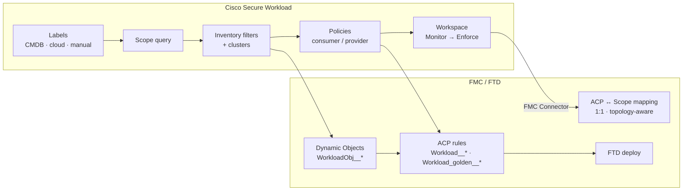

# Scope, Query, Inventory Filters & ACP Mapping

How **CSW scope queries**, **inventory filters**, and **clusters** become **FMC Dynamic Objects** (`WorkloadObj__*`) and **ACP rules** — with video and documentation references.

> **Disclaimer:** Companion material. Authoritative sources:
> - [FMC Integration Guide](https://www.cisco.com/c/en/us/td/docs/security/workload_security/secure_workload/integration/fmc/cisco-secure-workload-and-fmc-integration-guide.html)
> - [Secure Workload & Firewall deep dive](https://secure.cisco.com/secure-workload/docs/secure-workload-whitepaper)
> - CSW User Guide — *Scopes*, *Inventory Filters*, *Manage Policy Lifecycle*

**Architecture diagrams:** [ARCHITECTURE.md](ARCHITECTURE.md) · **Firewall integration steps:** [INTEGRATION-GUIDE.md](INTEGRATION-GUIDE.md)

---

## Terminology — do not confuse these

| Concept | What it is | Role in firewall enforcement |
|---------|------------|------------------------------|
| **Scope** | Hierarchical container for policy (parent/child tree) | **One scope maps to one FMC ACP** (1:1) |
| **Scope query** | Boolean query defining which workloads belong in a scope | Drives scope membership; changes need **commit** + impact review |
| **Label** | Key/value metadata on workloads (CMDB, cloud tag, manual) | Used **inside** scope queries and policy consumers/providers |
| **Inventory filter** | Named, reusable query (scope-bound) for grouping workloads | Becomes IP sets → **`WorkloadObj__*`** dynamic objects in FMC |
| **Cluster** | ADM-derived workload group (often ephemeral) | Can be **converted to inventory filter** for stable enforcement |
| **`WorkloadObj__*`** | FMC **Dynamic Object** created by CSW FMC connector | Membership updates automatically when inventory changes |
| **`Workload__*` / `Workload_ca__*`** | FMC **ACP rules** pushed from enforced CSW workspaces | L3/L4 segmentation rules referencing `WorkloadObj__` objects |
| **CSDAC** (FMC Dynamic Attribute Connector) | **Separate** FMC feature for cloud tag → FMC objects | AWS/Azure/GCP tags — **not** the CSW `WorkloadObj__` path |

**Key FMC integration quote (Cisco docs):**

> Secure Workload enforced segmentation policies are converted into Access Control Policies, utilizing **IP address sets derived from scopes, inventory filters, and clusters**. These sets are transformed into **dynamic objects** within FMC.

Network inventory is **dynamically updated** from inventory filters; when workloads are added, changed, or removed, CSW updates FMC Dynamic Objects and **auto-deploys** to FTD — no manual FMC redeploy for object membership changes.

---

## End-to-end mapping chain



**Order of operations:** Labels → Scope tree + queries → Inventory filters → ADM/policy → **then** FMC connector ACP mapping → enforce workspace.

---

## Phase 0 — Foundations (Jason Maynard)

**Jason Maynard** (*How Hard Can It Be?* series) covers CSW building blocks on his [YouTube channel](https://www.youtube.com/@jasonmaynard8773). Complete **before** ACP mapping — Jorge Quintero's firewall series assumes you understand scopes, labels, and filters.

| Order | Video | Steps / topics (from catalog) | Watch |
|------:|-------|-------------------------------|-------|
| 1 | **Cisco Secure Workload: Scopes** | Create scope tree; group workloads for policy; parent/child hierarchy | [YouTube](https://www.youtube.com/watch?v=3KBmanCNm4U) |
| 2 | **Cisco Secure Workload: Labels** | Tag workloads; use labels in queries and policy | [YouTube](https://www.youtube.com/watch?v=NLoZq0wiTU8) |
| 3 | **Cisco Secure Workload: Inventory Filters** | Build filters to focus inventory; reusable query groups | [YouTube](https://www.youtube.com/watch?v=fJd6V15UiZM) |
| 4 | **Application Dependency Mapping & Policy Analysis** | Map dependencies; derive segmentation policy from flows | [YouTube](https://www.youtube.com/watch?v=Jzzblea25UA) |
| 5 | **Dynamic Workloads & Policy** | Policy adapts as workloads move or scale | [YouTube](https://www.youtube.com/watch?v=Aajlx7JT2G4) |
| 6 | **Policy Visual and Quick Analysis** | Visualize policy impact before enforce | [YouTube](https://www.youtube.com/watch?v=uBxrJaVLHy4) |
| 7 | **Production and Test Risk Reduction** | Macro-segment prod vs non-prod (common first firewall scope) | [YouTube](https://www.youtube.com/watch?v=HKT18Ylt4IY) |
| 8 | **Flow Analysis** | Validate NSEL/agent flows before policy (pairs with Part A of firewall guide) | [YouTube](https://www.youtube.com/watch?v=Tuw06kPjeyQ) |

**Official channel refresh:** [Inventory Filters (2025–2026)](https://youtu.be/ymCB_PkFYcI) — [@ciscosecureworkload](https://www.youtube.com/@ciscosecureworkload)

---

## Phase 1 — Scope query (CSW UI / API)

Define **which workloads** belong in each scope before FMC mapping.

### Steps (CSW User Guide + OpenAPI)

| Step | Action | Notes |
|------|--------|-------|
| 1 | **Manage → Scopes** (or tenant scope tree) | Plan parent (multi-app) vs child/leaf (single app) before FMC |
| 2 | **Create a New Scope** | Name aligned to app or zone boundary (e.g. `Prod-Payments-App`) |
| 3 | **Edit scope query** | Use labels, IP, hostname, agent attributes, connector metadata |
| 4 | **Review Scope Query Change Impact** | UI modal shows affected workloads and policies |
| 5 | **Commit scope query changes** | API: `POST /scopes/{id}/commit_query_changes` — until committed, query is draft |
| 6 | **View workloads in scope** | Confirm count matches expectation before enforce |
| 7 | **Policy inheritance** | Child scopes inherit parent **guardrail** policies (relevant for leaf → ACP mapping) |

### Scope mapping strategy for FMC

| FMC mapping | Map this scope type | CSW pushes |
|-------------|---------------------|------------|
| **Single application** | **Child / leaf scope** | That app's policies + parent guardrails |
| **Multiple applications** | **Parent scope** | Parent + eligible **child** scope policies (hierarchical) |

**Constraint:** **One ACP ↔ one scope only.** Plan one FMC Access Control Policy per segmentation boundary.

---

## Phase 2 — Inventory filters & clusters

Inventory filters are the **primary query objects** that become **`WorkloadObj__*`** IP sets in FMC.

### Steps (CSW User Guide)

| Step | Action | Notes |
|------|--------|-------|
| 1 | **Create an Inventory Filter** | Scope-bound; name reflects consumer/provider role (e.g. `web-tier`, `db-tier`) |
| 2 | **Validate an inventory filter query** | API: validate before save — check match count |
| 3 | **Review Filter Change Impact** | Shows policy/workspace impact before commit |
| 4 | Run **ADM** / accept clusters | ADM may propose **clusters** as workload groups |
| 5 | **Convert a Cluster to an Inventory Filter** | Stabilize ADM output for enforcement |
| 6 | Use filters as **policy consumer/provider** | Policies reference filters, not raw IP lists |
| 7 | **Dynamic Workloads & Policy** | When labels/IPs change, filter membership refreshes → FMC objects update |

### Query building tips

- Combine **labels** (from ServiceNow, cloud connectors, manual) with **IP/subnet** for agentless NSEL-visible hosts.
- Keep filter names stable — FMC `WorkloadObj__` names derive from CSW objects.
- Prefer **inventory filters** over ad-hoc IP lists in policies for FMC dynamic object hygiene.

---

## Phase 3 — Policy workspace (before FMC push)

| Step | Action | Notes |
|------|--------|-------|
| 1 | Create **workspace** tied to target **scope** | Primary workspace for the app |
| 2 | **ADM** or manual policies — consumer/provider use inventory filters | See Jason Maynard ADM + Policy Visual videos |
| 3 | **Monitor / Simulate** | No FTD push yet |
| 4 | **Policy Visual** — allowed/denied impact | Validate with app owner |
| 5 | Document **Absolute vs Default vs Catch-All** rank | Maps to FMC Mandatory vs Default sections |

---

## Phase 4 — ACP ↔ Scope mapping (FMC Connector)

**After** scope queries, filters, and monitor-mode policy are validated — configure FMC connector **Segmentation** tab.

### Prerequisites

- FMC connector **connected** (Event Log clean)
- FTD devices assigned to target **ACP**; FMC deploy verified
- **One scope** selected per ACP

### Steps ([FMC Integration Guide](https://www.cisco.com/c/en/us/td/docs/security/workload_security/secure_workload/integration/fmc/cisco-secure-workload-and-fmc-integration-guide.html))

| Step | UI action | Detail |
|------|-----------|--------|
| 1 | **Manage → Workloads → Connectors → Cisco Secure Firewall** | Open existing FMC connection |
| 2 | **Segmentation** tab → **+ Add** | Add ACP Mapping |
| 3 | Choose **Access Policy** (ACP) from FMC dropdown | Must match FTD assignment in FMC |
| 4 | Map to **one Scope** | 1:1 — cannot map multiple scopes to one ACP |
| 5 | **Use Secure Workload Catch-All** | CSW catch-all in Default section, or FMC default action |
| 6 | **Enforcement Mode** | **Merge** (dual-management) or **Override** (CSW-only in section) |
| 7 | **Absolute / Default Policies** priority | Merge only: insert above/below Mandatory/Default rules |
| 8 | **Submit** | Topology awareness pushes rules only to FTDs on traffic path |
| 9 | **Enable enforcement** on CSW workspace | Triggers push of objects + rules |
| 10 | Verify in FMC | Objects: `WorkloadObj__*` · Rules: `Workload__*`, `Workload_golden__*`, `Workload_ca__*` |
| 11 | **Event Log** tab | Filter errors (red); download JSON/CSV if needed |

### What CSW creates in FMC

| FMC artifact | Prefix | Section |
|--------------|--------|---------|
| Golden rules (CSW ↔ agents behind FW) | `Workload_golden__` | Mandatory |
| Segmentation rules from enforced workspace | `Workload__` | Mandatory / Default |
| Catch-all (if enabled) | `Workload_ca__` | Default |
| Dynamic objects from scopes/filters/clusters | `WorkloadObj__` | Object Management |

| CSW policy rank | FMC ACP category |
|-----------------|------------------|
| **Absolute** | Mandatory |
| **Default** | Default |

> **Do not edit** `Workload_*` rules or `WorkloadObj__` objects manually in FMC — CSW overwrites on next push.

### Edit / view mapping later

1. **Defend → Segmentation** → select policy → pencil icon → **Submit** → **Save**
2. **Domains** tab (FMC connector config) — view which FMC domains are enforced (3.9.1.1+)

---

## Phase 5 — Firewall integration videos (Jorge Quintero)

After Phase 0–4 concepts, watch Jorge's series for **NSEL + FMC connector deployment**:

| Part | Focus | Watch |
|------|--------|-------|
| 1 | Design & architecture | [YouTube](https://youtu.be/vdHjAl48SuI) |
| 2 | Deployment & policy flow | [YouTube](https://www.youtube.com/watch?v=xpbg3s0vrcI) |
| 3 | Enforcement & operations | [YouTube](https://www.youtube.com/watch?v=X65mwN7kJGg) |

---

## CSW `WorkloadObj__` vs FMC CSDAC (Dynamic Attributes)

| | **CSW → FMC (`WorkloadObj__`)** | **FMC CSDAC** |
|---|--------------------------------|---------------|
| **Source** | CSW scopes, inventory filters, clusters | AWS/Azure/GCP/VMware tags via FMC connector |
| **Configured in** | CSW UI + FMC connector Segmentation | FMC → Dynamic Attributes Connector |
| **Use with CSW firewall integration** | **Yes — required** for CSW-driven segmentation | Optional — parallel cloud-native object path |
| **Doc** | [FMC Integration Guide](https://www.cisco.com/c/en/us/td/docs/security/workload_security/secure_workload/integration/fmc/cisco-secure-workload-and-fmc-integration-guide.html) | [CSDAC overview](https://secure.cisco.com/secure-firewall/docs/cisco-secure-dynamic-attribute-connector) |

For a **CSW POV with FMC enforcement**, you need the **CSW FMC connector** path. CSDAC is complementary when FMC also needs cloud tag-based objects outside CSW policy.

---

## Validation checklist

| # | Check | Pass criteria |
|---|-------|---------------|
| 1 | Scope query committed | Workload count stable; impact review done |
| 2 | Inventory filters validated | Match expected tiers; names stable |
| 3 | Policies use filters (not static IPs) | Consumer/provider reference filters/clusters |
| 4 | Workspace in Monitor | ADM/policy validated with app owner |
| 5 | ACP mapping 1:1 | One scope per ACP; topology correct |
| 6 | FMC `WorkloadObj__*` populated | Objects show current IPs |
| 7 | Post-enforce deny test | Blocked at FTD; CSW shows rejected flow |
| 8 | Add/remove test workload | Filter membership + FMC object update without manual FMC edit |

---

## FAQs (scope / query / ACP)

| Question | Answer |
|----------|--------|
| Multiple scopes on one ACP? | **No** — strictly 1:1 |
| Mixed agent + agentless behind same FW? | Works; agent host rules may **also** appear in ACP (hierarchical policy) |
| Edit `Workload__` rule in FMC? | CSW **restores** on next push |
| Layer 7 on CSW rules? | **Not supported** — L3/L4 east-west only |
| Scope query change after enforce? | Review impact → commit → FMC objects refresh on push |
| Cluster vs inventory filter? | Convert clusters to filters for stable FMC object mapping |

---

## Recommended learning order

```text
Jason Maynard: Scopes → Labels → Inventory Filters → ADM → Policy Visual
    → Jorge Quintero: Firewall Integration Parts 1–3
    → This doc: Scope query → Filters → ACP mapping → Enforce
    → INTEGRATION-GUIDE.md: NSEL ingest + FMC connector setup detail
```
